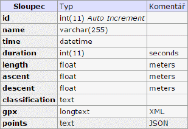

# Semestrální práce MI-VMW
## Analyzér a klasifikátor GPS záznamù

**2014 Bc. Pavel Zbytovskı, FIT ÈVUT**

## 1) Popis projektu

Cílem projektu je vytvoøit webovou aplikaci, která umí zobrazit záznamy z GPS nad planárním prostorem, umìt je rychle klasifikovat a procházet. Vstupem jsou záznamy ve formátu GPX, které se nahrají do webového rozhraní. Vıstupem aplikace je zobrazení stop s provedeou klasifikací pro snadné odlišení.

## 2) Zpùsob øešení

Klasifikace s rozlišením pìších, cyklistickıch a motorovıch stop má na starosti metoda `getClassification()`. GPS záznam se skládá z jednotlivıch bodù s polohopisem, vıšekopisem a èasovou informací s pøesností na vteøiny. Z tohoto dùvodu je nutno nejdøíve seskupit více bodù do skupiny, abychom se vyvarovali vysoké nepøesnosti èasového rozdílu. Pro kadou skupinu je spoèítána pøesná vzdálenost jednotlivıch mezibodù Haversinovım vzorcem a spoèten celkovı èas. Granularita byla zvolena 60 vteøin.

Druhım krokem je proèištìní zarušenıch chybovıch skupin. Napø. pøi delším zastavení na místì vzniká velké mnoství bodù, které se ovšem od prvního pøíliš nevzdalují. Déle je tøeba odstranit delší chybìjící záznam – ten mùe vzniknout pauznutím zaznamenávání èi rušením signálu tøeba okolním terénem.

Tøetím krokem je samotná klasifikace, kde se vyuívá prahového øešení. Pokud skupina má rychlost odpovídající nìkteré tøídì, je jí pøiøazena a dopoèteny souhrnné hodnoty èasu a vzdálenosti pro danou tøídu.

## 3) Implementace

Webová aplikace je postavená nad jazykem PHP a vyuívá ke svému bìhu framework Nette 2.2.6 ([http://nette.org](http://nette.org/)). Hlavní prezentaci mapového obsahu obstarává knihovna Leaflet ([http://leafletjs.com](http://leafletjs.com/)). Doplòkové skripty v jazyce JavaScript zajišují souèinnost tìchto dvou èástí.

Hlavní logika vıpoètù a klasifikace se ukrıvá ve tøídì `GpsPath`, ta na svém vstupu dostává GPX soubor standardu XML, proèítá jej a získává hodnoty k zobrazení – napø. délku trasy, pøevıšení, èi vıbìr bodù pro zobrazení na mapì. O klasifikaèní metodì je pojednáno vıše.

Pro uivatele je pøipraven pohodlnı vsup pro nahrávání GPX souborù – vyuívá se knihovny jQuery File Upload Plugin, kterı umí vícenásobné nahrávání ([https://github.com/blueimp/jQuery-File-Upload](https://github.com/blueimp/jQuery-File-Upload)). Zobrazení prùbìhu zajišuje Mini Ajax File Upload Form ([http://tutorialzine.com/2013/05/mini-ajax-file-upload-form/](http://tutorialzine.com/2013/05/mini-ajax-file-upload-form/)).

Po nahrání je GPX stopa podrobena rozboru pomocí tøídy GpsPath a vısledek je uloen do MySQL databáze, viz Obrázek 1.

Poadavky na bìh: PHP 5.6, MySQL 5.5.27, prohlíeè kompatibilní HTML5.

  
_Obrázek 1: Schéma tabulky gpx_

## 4) Pøíklad vıstupu

Okno aplikace (Obrázek 2) obsahuje po levé stranì seznam všech nahranıch souborù, po najetí se zazoomuje zaznamenaná stopa na mapì. Tématickou vrstvu lze pøepnout v pravém horním rohu.

Klasifikace je znázornìná ikonou, konkrétní vıstup algorimu je pro tento øádek takovı:

```
{result: bike, car: {treshold: 40, duration: 60.0, length: 673.23801979931}, bike: {treshold: 8, duration: 15721.0, length: 82409.175640864}, walking: {treshold: 2, duration: 1952.0, length: 3085.7008182243}}
```

  
_Obrázek 2: Okno vısledné aplikace s zobrazení stopy_

## 5) Experimentální sekce

Vıkonovì je algoritmus velmi rychlı, asymptoticky O(n), kde n je poèet záznamù v GPS logu. Vıpoèetnì se provádí právì Haversinùv vzorec:

  

Èasová závislost je v Tabulce 1. Pro vìtší mnoství záznamù jsou ji èasy docela dlouhé, zde by mohlo pomoci napøíklad pøedzpracování dat do rychlejšího formátu ne XML, èi proudové zpracování.

 n  | t [ms]
---:| ---:
4 683 | 681
9 479 | 1 126
24 805 | 2 801
36 973 | 5 004

_Tabluka 1: èasová zavislost pro rùzné poèty prvkù_

## 6) Diskuze

Kdy pomineme hledisko uivatelského rozhraní èi multiuivatelského prostøedí, vyvstává pøed námi pøedevším otázka ukládání a zpracování geografickıch dat v gis databázích. Díky takovému uloení by mohlo bıt mnohem rychlejší zpracování a té by se otevøely obzory k další práci s daty. Nabízí se tøeba hledání spoleèné cesty, a následné mìøení rùznıch dosaenıch rychlostí na tìchto segmentech, èi rychlé vykreslení do rastrové vrstvy na stranì serveru.

## 7) Závìr

Práce øešila problém klasifikace a zobrazení gps stop. Povedlo se vytvoøit funkèní aplikace pro jednouiatelské prostøedí, která tento problém øeší a nabízí uivateli funkèní základ pro správu dat. Aplikace je napsaná na robustním základu a tedy umoòuje další rozvoj v budoucnu.


