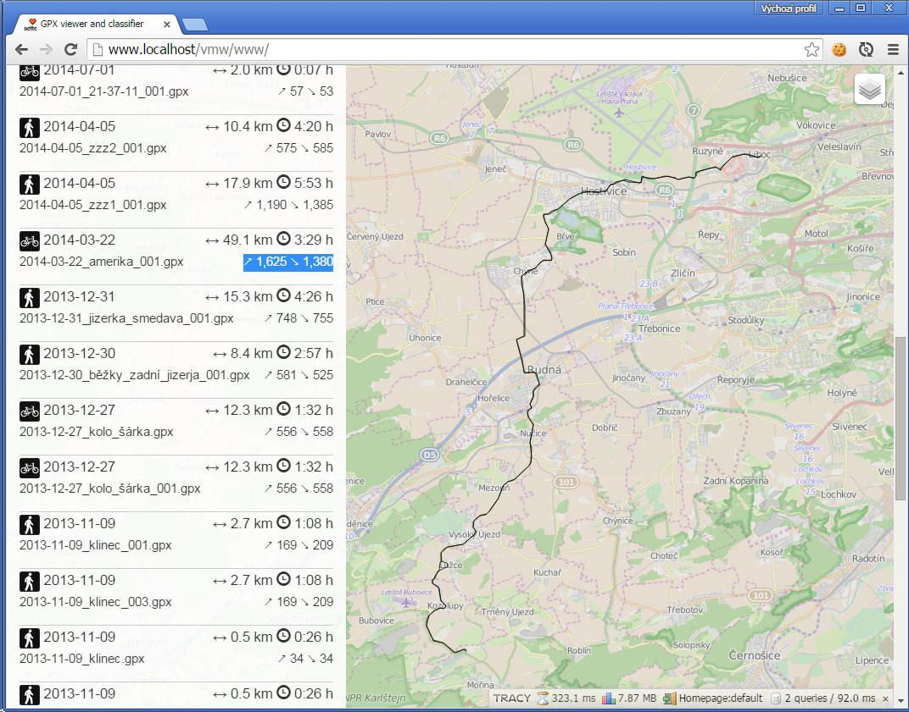

# gpx-analyzer - display & classify GPX traces

 - [Czech documentation](docs/)
 - [SQL Export with testing data](docs/database.sql) (3 MB)

## Instalation

```sql
CREATE TABLE `gpx` (
  `id` int(11) NOT NULL AUTO_INCREMENT,
  `name` varchar(255) COLLATE utf8_czech_ci NOT NULL,
  `time` datetime NOT NULL,
  `duration` int(11) NOT NULL COMMENT 'seconds',
  `length` float NOT NULL COMMENT 'meters',
  `ascent` float NOT NULL COMMENT 'meters',
  `descent` float NOT NULL COMMENT 'meters',
  `classification` text COLLATE utf8_czech_ci NOT NULL,
  `gpx` longtext COLLATE utf8_czech_ci NOT NULL COMMENT 'XML',
  `points` text COLLATE utf8_czech_ci NOT NULL COMMENT 'JSON',
  PRIMARY KEY (`id`)
)
```

## Screenshot




## Author and licence

(c) 2014 [Pavel Zbytovský](http://zby.cz)

Licenced under MIT license.
